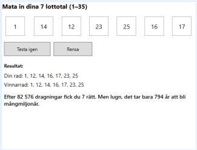

# Lottomaskinen

## Del 1 – Rätta en rad
Användaren matar in 7 tal (1–35).  
Programmet ska slumpa fram en vinnarrad och visa hur många rätt användaren fick.

### Exempel
| Din rad | Vinnarrad | Resultat |
|----------|------------|-----------|
| 1, 4, 14, 19, 22, 23, 34 | 1, 5, 8, 14, 19, 23, 29 | Du fick 3 rätt. |

Visa i gränssnittet din och lottomaskinens drag.
```csharp
 txtDrawRow.Text = $"Vinnarrad: {string.Join(", ", lottomaskinen)}";
 txtUserRow.Text = $"Din rad: {string.Join(", ", gissningen)}"
 ```

## Tips

- Använd `TextBox.Clear()` för att tömma textfälten när du rensar formuläret.  
- Sortera raderna före visning med:
```csharp
  Array.Sort();
```
- Nollställ en array vid fel eller ny omgång:
 ```csharp
  Array.Clear();
```

---
## Del 2 – Unika nummer
Bygg en metod som kontrollerar att användaren har matat in **unika nummer**.  

### Krav
- Inga dubbla tal får förekomma i användarens rad.  
- Om ett tal förekommer mer än en gång ska programmet visa ett tydligt felmeddelande.  
- Metoden ska returnera true eller false beroende på om alla tal är unika.

### Självtest
- Dubbla värden (t.ex. 5 två gånger) ska upptäckas.  
- Raden kontrolleras innan rättning sker.  
- Programmet fungerar korrekt även när alla tal är unika.

---

## Regler
- Använd arrayer och loopar.  
- Ingen LINQ, Regex eller färdiga metoder som Distinct. 


# Del 3 – Hur svårt ska det va att få sju rätt?

Detta är ett valfritt **stretch goal** för dig som vill ta det ett steg längre.  
Programmet ska simulera lottodragningar tills användaren får **7 rätt** och visa hur många dragningar det tog.

---

## Krav
- Räkna antalet dragningar tills alla sju tal matchar.  
- Visa tal med **tusentalsavgränsare**.  
- Utgå från att det sker **två dragningar per vecka** (onsdag och lördag).  
- Det är alltid **52 veckor per år**.  
- Visa även hur många **år** det motsvarar, avrundat till heltal.

---

## Exempel på presentation
Efter 24 654 500 dragningar fick du 7 rätt.  
Det motsvarar cirka 237 062 år.

---

## Tips
- Använd en `do-while`-loop när minst ett drag alltid ska göras.  
- Formatera stora tal med `N0` för tusentalsavgränsare:  
- - Nollställ en array vid fel eller ny omgång:
 ```csharp
   txtMatches.Text = $"Efter {attempts:N0} dragningar fick du {correct} rätt";
```
  
- Omvandla dragningar till tid:
  - **Veckor:** avrunda uppåt (dragningar ÷ 2)
  - **År:** avrunda uppåt (veckor ÷ 52)

---

## Självtest
- [ ] Dragningarna fortsätter tills exakt **7 rätt**.
- [ ] Antalet dragningar visas med **tusentalsavgränsare**.
- [ ] Åren visas som heltal enligt antagandet **2 dragningar/vecka** och **52 veckor/år**.
- [ ] Vinnarraden slumpas med unika tal.

---




